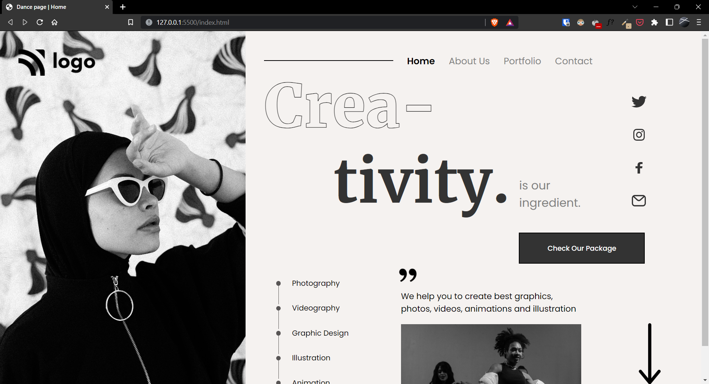

# Project-14 | Dance Web Page

Hi there,
I'm Wasit Ali and this is my 14th project on HTML and CSS.

## 🖥 Preview

🚀 [Live Preview](https://live-class-project-14-topaz.vercel.app/)

## 🛠️ What I have learned in this project?

- CSS flexbox usecase.
- Learnt about behaviour of an image element on different div sizes.
- Handled mobile Responsive With Media Queries along with CSS flexbox.

## ⏲ Time taken to finish the project

- Around 24 hours
